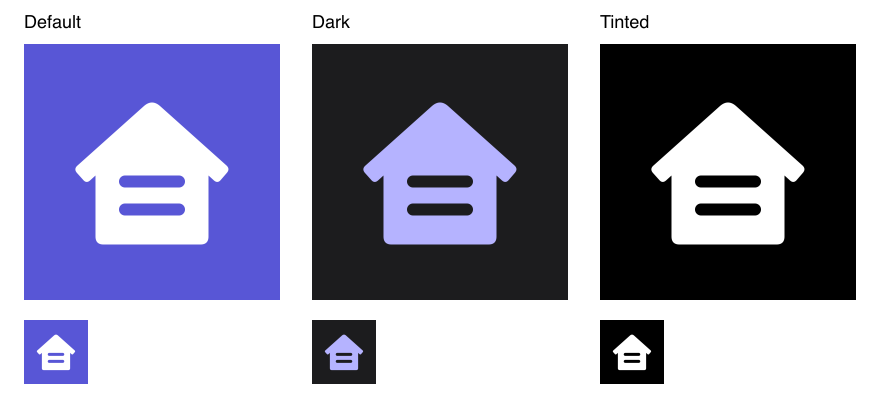

# App icon

The original vector combines a house with a cut-out equals sign. Indigo, a single silhouette and generous margins keep it recognizable at small sizes. No SF Symbol, text glyph, baked corner mask, shadow or glass effect is used.

`AppIconModern.appiconset` provides 1024px Default, Dark and Tinted PNGs. Default is opaque indigo and white; Dark has a transparent background and a lavender foreground; Tinted is grayscale. This asset-catalog implementation follows [Apple's app-icon configuration guidance](https://developer.apple.com/documentation/xcode/configuring-your-app-icon) and [app-icon HIG](https://developer.apple.com/design/human-interface-guidelines/app-icons).

The selected icon is a flat asset catalog, not a layered Icon Composer document. The initial Icon Composer UI connection failed to return a usable state, so no `.icon` document was created. These previews show the authored images at 256px and 64px, without simulated system glass or masking.

Regenerate the PNGs from `mortgage-icon.svg` using `node docs/design/render-icons.cjs /absolute/path/to/sharp`. Sharp is an authoring dependency only; the app has no added runtime dependency. The app target selects `AppIconModern` through `ASSETCATALOG_COMPILER_APPICON_NAME` in both Debug and Release. The unselected original icon catalog has been removed; Git history retains its artwork.

Xcode 27's `actool` compiled this icon set for iPhone and iPad with deployment target iOS 17, generating `Assets.car`, scaled icons and primary icon metadata for `AppIconModern`. All three source PNGs are 1024×1024; Default and Tinted have no alpha channel, Dark does, and every Tinted pixel has equal RGB channels. The selected icon was verified on the iOS 27 iPhone and iPad Home Screens in the retained [iPhone capture](../media/iphone-home-screen-icon.png) and [iPad capture](../media/ipad-home-screen-icon.png). The additional generic icon is the XCTest runner. Dark and Tinted source variants were validated and compiled; these checks do not establish layered Icon Composer rendering or every system appearance on physical devices.
